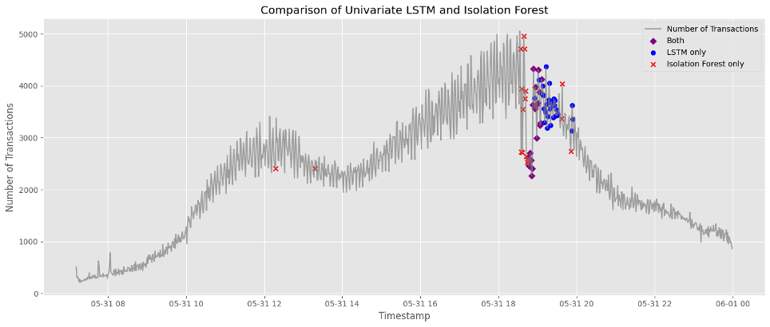
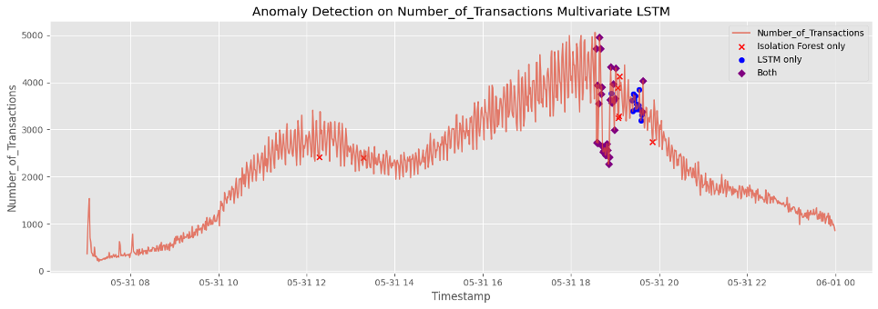

# ML-Group-8-Project-Work
## INTRODUCTION

 The project, commissioned by Reply SPA, has as its primary objective the definition of a model able to detect and identify abnormal behaviors in system operations.
 The dataset provided by the company consists of time-series data stored in a single file and contains information related to key performance indicators such as:
 -	Code_ID
 -	Timestamp
 -	Number of Transactions
 -	Minimum and Maximum Processing Time
 -	Number of Retries
 -	Number of Wrong Transactions
 The data spans a single working day (7.00 AM- 11:59PM) with records collected at one-minute intervals.
 As requested by Reply, the project followed a structured approach consisting of an initial exploratory data analysis, synthetic data generation to overcome the dataset’s limited size, the development of forecasting models, and the final implementation of anomaly detection techniques.
 Based on this workflow, we focused on understanding the structure of the data and identifying potential abnormal values. We then proceeded to design predictive models aligned with the project’s objectives, while also applying data augmentation techniques to enrich the training set and improve model robustness.
 

## METHODS

TTo detect anomalies, we used LSTM forecasting models to learn the expected behavior of the given time series and identify significant deviations in real time, flagging them as potential anomalies as soon as they happen.
The project workflow included:

Data Loading --> Exploratory Data Analysis and Preprocessing --> Outlier Identification and Handling --> Data Augmentation --> Feauture Engineering --> Univariate LSTM Forecasting --> Residual Calculation on Day 0 --> Anomaly Detection --> Comparison to anomaly detected by Isolation Forest --> Multivariate LSTM Forecasting --> Residual Calculation on Day 0 --> Anomaly Detection

#### Exploratory Data Analysis and Preprocessing 
After loading the dataset, we conducted exploratory data analysis (EDA) to assess data quality, feature relevance, and statistical properties. 
As a first step, we dropped the columns “INTERVALLO\nACQUISIZIONE” and “COD \nGIOCO”, since both contained constant values across all observations, providing no discriminative or predictive power, making them irrelevant for both anomaly detection and forecasting tasks. We also computed the correlation matrix to identify highly correlated variables. All the time variables, except for “Time_Min” were higly corellated between them and also with the number of retries. For this reason and because of their uninterpretable nature, we decided to drop also “Time_Min” and “Time_max”.
After removing non-informative features, we proceeded to visualize all remaining variables over time to uncover temporal trends and potential irregularities. This analysis revealed a pronounced deviation occurring around 7:00 p.m., suggesting the presence of a significant anomaly in the system behavior. The presence of this irregularity in all features indicates that this was not a random fluctuation or normal behavior, but rather a systemic event, thus deserving further investigation.
To do so and validate these initial observations, we employed an Isolation Forest algorithm, a robust and unsupervised method for anomaly detection.
Isolation Forest was particularly suitable for our case, as it can naturally handle multivariate data, allowing us to consider joint patterns across the 4 selected features rather than analyzing each variable in isolation. This was crucial given the coherent anomaly pattern observed across multiple variables. 
Unlike traditional density-based or distance-based approaches, Isolation Forest works by actively isolating anomalies instead of modeling normal behavior. It constructs an ensemble of random binary trees and identifies as anomalous those data points that require fewer splits to be isolated, leveraging the assumption that anomalies are both rare and distinct. 
The results confirmed our initial hypothesis: the Isolation Forest algorithm identified 36 outliers, with a clear temporal concentration around 7:00 p.m. This finding provided quantitative validation of the irregularities observed during our exploratory analysis. The alignment between the model’s output and our visual insights reinforced the robustness of our approach and established a reliable basis for downstream tasks, particularly in the design of our forecasting and anomaly detection framework.
This confirmation not only supported our initial EDA findings but also helped guide the next steps in our project. Since the data from the provided day contained many anomalies, we decided it could not be used as the base for data augmentation, which was needed to train our forecasting model. Using this abnormal day as a reference would have caused the model to learn incorrect patterns, making it treat unusual behavior as normal, and making it less effective at detecting real anomalies in the future.

#### Outlier Identification and Handling 
We created a copy of the original dataset in which all values flagged as outliers were replaced with NaN. We then explored several imputation strategies to fill these missing values. Traditional methods such as linear interpolation, spline interpolation, and predictive approaches like K-Nearest Neighbors (KNN) were tested, but they yielded unsatisfactory results, either due to unrealistic reconstructions or poor generalization across different variables.
Ultimately, we adopted a more robust strategy by imputing missing values using an hourly rolling mean calculated from the “Timestamp” column. To preserve the natural variability in the data, we added Gaussian noise scaled by the rolling standard deviation. Finally, the imputed values were clipped to predefined, variable-specific bounds to ensure that the generated values remained within realistic and domain-consistent ranges. 

#### Data Augmentation
At this point, we had reconstructed what appeared to be a normal day. Based on this cleaned version, we implemented a data jittering technique for the data augmentation task: we defined a function that, starting from this baseline day, adds random Gaussian noise to simulate realistic variations and generate synthetic days. This allowed us to generate two more days (as suggested by Reply during the checkpoint) enriching the dataset for training the forecasting model while preserving the underlying structure of normal system behavior.
Several other attempts were made to adopt more advanced generative methods, such as TimeGAN and Variational Autoencoders (VAE), in order to synthesize realistic time series data. However, due to the limited size of the original dataset and the complexity of these models, we weren’t able to produce synthetic data that maintained sufficient consistency with the original ones, as required by Reply. 

#### Feature Engineering
We then carried out a feature engineering process to enrich the temporal dynamics of the data, creating these new features:
-	Lagged values to provide historical context
-	Rolling statistics (e.g., mean, standard deviation) for smoothing and trend detection - shifted to avoid leakage
-	Step-wise changes to highlight abrupt variations
-	Ratios related to errors and retries for performance insights
-	Time of day to incorporate cyclical patterns.
These features were computed individually for each day before merging, to ensure that the model would not learn wrong patterns across day boundaries, given the fact that our days started at 7 am e not at 12 am. We then removed the initial rows of each day to eliminate all the NaNs values generated by lag-based and rolling features.

#### Modeling
Once the feature engineering was completed, we merged all the synthetic days to form the final dataset used for model training.
For forecasting, we selected a Long Short-Term Memory (LSTM) neural network due to its proven ability to model sequential dependencies in time series data. The LSTM was configured with an input window of 30 minutes (i.e., the model receives 30 minutes of past data) to predict the next 10 minutes of system behavior.
Once the model was trained, we evaluated its ability to detect anomalies by testing it on the original dataset, which still included known outliers. This approach was intentional: had we trained directly on the unfiltered data, the model might have learned to treat abnormal patterns as normal, reducing its effectiveness in detecting true anomalies. By separating training (on clean, augmented data) from testing (on the original dataset), we ensured that the model could learn normal behavior and accurately flag deviations. The forecasting-based approach enables anomaly detection by comparing predicted values with actual observations, when the difference (residual) exceeds a predefined threshold, the point is flagged as anomalous. This method reveals the model’s full potential, making it not only a forecasting tool but also a reliable anomaly detection system.
As we’ll explore in the next sections, we decided to extend our approach by building a multivariate LSTM model.

## EXPERIMENTAL DESIGN

The main objective of this experimental phase was to verify whether a prediction-based methodology would be a useful support for the identification of anomalies in high frequency system metrics. Specifically, we trained a univariate LSTM model on past transaction volume data. The intention was to obtain correct predictions on future short-term values and at the same time, flag significant deviations from expected behavior as potential anomalies. 
The underlying hypothesis of our approach is that by modelling the normal evolution of system behaviour over time, any deviation from the expected trajectory can be identified as an anomaly. Thanks to its recurrent architecture and ability to capture temporal dependencies, the LSTM model operates effectively across time, making it particularly well-suited for learning patterns in sequential data and ensuring reliable anomaly detection performance.
In the first forecasting experiment the univariate LSTM model, (RNN) was trained to predict the next 10 minutes of “Number_of_Transactions” based on the pevious 30 minutes of observations of the same variable. This design enables the network to learn short-term trends and variability without the additional complexity of a multivariate design, providing a clean and interpretable configuration to evaluate the impact of temporal modeling in isolation. 
To benchmark our LSTM model, we selected Prophet as a baseline forecasting method. Prophet is a modular, additive time-series capable of capturing trends and seasonal components with minimal parameter tuning. Its advantages include:
•	Minimal setup: easy to deploy with default parameters
•	Interpretability: decomposes outputs into trend and seasonality components
•	Simplicity: no need for feature engineering or deep learning framework
However, Prophet also presents key limitations in our context:
•	It is not autoregressive, meaning that its predictions are not directly conditioned on recent observations
•	It performs poorly in the presence of non-linear behaviour or abrupt changes
•	It cannot integrate engineered or exogenous features unless manually specified.
Despite these limitations, Prophet was a reasonable baseline to show the benefit of deep sequence models like seq2seq LSTM with encoder-decoder structure.
To make a comparison of performance between the models, we used two typical metrics: 
•	Root Mean Squared Error (RMSE) that we select for its punishment of big errors, which is analogous to our anomaly detection requirement.
•	R² Score: To assess the extent to which the model explains the variance of the target variable and provides a measure of how well it can generalize. 
These metrics give a solid foundation for performance assessment in forecasting and inform subsequent anomaly detection choices.
From the residuals that we obtained from the forecast model, we developed an anomaly detection pipeline to discover irregularity behavior in the system.
Our approach was based on the assumption that a forecasting model trained to accurately reproduce normal temporal behaviour can identify anomalies as deviations from the expected trajectory. In order to make this notion practical, we employed a residual-based anomaly detection method, leveraging the univariate LSTM model's error in forecasting. 
For each 10-minute prediction horizon, we computed the Mean Squared Error (MSE) between actual values and predicted values of  “Number_of_Transactions”. Anomaly observations were flagged whenever their residual was higher than a statistically calculated cutoff. We specifically set a threshold at the 95th percentile of the residual distribution so as to be aware of outliers without generating false positives.
To validate the residual-based detection approach, we compared its performance with that supplied by the Isolation Forest algorithm during the exploratory analysis phase. Even though Isolation Forest was used in a multivariate environment, our LSTM model during this phase remained univariate and this contributes, at least to some extent, to the noted differences.
The 29% of anomalies were detected by both methods. This small overlap is an effect of the methodological divide: Isolation Forest identifies anomalies based on feature space partitioning, while LSTM-based detection comes from temporal prediction errors.
Despite the divergence, comparison helped us to confirm the stability of our approach, which balances accuracy in identifying prominent anomalies with consistent sensitivity over time.
Due to the lack of labeled ground truth, common classification metrics such as precision or recall were not feasible. We rather utilized qualitative evaluation criteria:
-	Temporal localisation of anomalies 
-	Consistency with known anomaly zones (e.g., the 7:00 p.m. spike)
-	Consistency with Isolation Forest results
These conditions provided robust qualitative support for the residual-based method and provided the basis for subsequent extension of our approach to a multivariate setting, as discussed in the following section.
The difference observed between the result of the univariate LSTM and the result obtained through the Isolation Forest indicated the potential benefit of applying a larger number of system metrics. In particular, such measures as “Time_Avg”, “Number_of_Retries”, and “Number_of_Wrong_Transactions” exhibited trends strongly correlated with abnormal behavior, so it appeared probable that a more comprehensive temporal representation would both enhance prediction performance and detect anomalies.
Encouraged by this insight, our final experiment sought to train a multivariate LSTM model that would learn more complex temporal patterns and relationships between system metrics. The model was implemented as a sequence-to-sequence architecture with the following four variables as inputs and targets:
-	Number_of_Transactions
-	Time_Avg
-	Number_of_Retries
-	Number_of_Wrong_Transactions
By employing multiple inputs and outputs, the multivariate LSTM was designed to identify not just individual trends but also interdependencies between metrics that collectively may indicate systemic anomalies. This allowed the model to predict multiple signals simultaneously and improve its contextualization of anomalies in terms of the overall system state.
Anomalies were again detected using a residual-based approach, this time by computing the multivariate average prediction error across all four target variables for every forecast horizon. A threshold based on a distribution was then utilized to label abnormal intervals.
This enhanced model exhibited better concordance with the anomaly patterns previously detected by the Isolation Forest, reflecting more comprehensive and consistent detection.
We then directly compared the anomalies identified by the multivariate LSTM with those found by the Isolation Forest, and observed greater overlap compared to the univariate setting, and verified the value added by multivariate temporal modeling.

## RESULTS 

The univariate LSTM model proved to be powerful for capturing unusual behavior in the system with an R2 of 0.91 and an RMSE of 312.82. it shows a better result compared to the prophet forecasting model used as baseline, which records an R² of 0.7459 and a RMSE of 583.63. Anomaly detection based on residuals, obtained using the univariate LSTM model, identifies a set of anomalies, 29% of which are also detected by the Isolation Forest, indicating a partial overlap in detection capabilities.
The multivariate LSTM model improved the univariate model's ability to capture system expected behavior and detect anomalies more reliably. In particular, the multivariate LSTM model records an R2 of 0.93 and a RMSE of 267.71 for “Number of transactions”. *aggiungere qualcosa sulle anomalies*

 

## CONCLUSIONS

Our project results demonstrate that an LSTM forecasting model can effectively detect anomalies in the considered system. Furthermore, when benchmarked against an Isolation Forest LSTM-based forecasting approach, especially the multivariate one, not only identified a similar number of anomalies but also detected them earlier. This makes it well-suited for real-time and proactive monitoring applications. Having taken the anomalies identified by the isolated forest as a reference, we were able to get feedback on making sure that the model detected the correct anomalies. While our results are promising, we should highlight some limitations as well as delineate natural next steps for the direction of future work. 
Firstly, the dataset we had was relatively small, and our data augmentation strategy relied on simple noise-based injection of a single baseline day. This limits the diversity of training examples and may reduce the model’s ability to generalize to more complex or unexpected patterns. In future work, more advanced augmentation techniques, such as GAN, Variational Autoencoders etc. could help the model better capture temporal variability and realistic fluctuations in system behavior.
Also, our evaluation of anomaly detection performance was primarily based on known outliers from the original dataset. While the model successfully identified these, we have not yet assessed its robustness to unseen or qualitatively different types of anomalies. A larger sample of test, possibly including synthetic or labeled real-world anomalies, would be necessary to evaluate generalization.
Lastly, the threshold we set, using the 95th percentile of residuals, was a simple and effective starting point. It could be overcome by finding new thresholding strategies, able to adapt to changing conditions. In future versions, exploring dynamic thresholding techniques could improve accuracy, helping reduce false positives in more variable environments.
